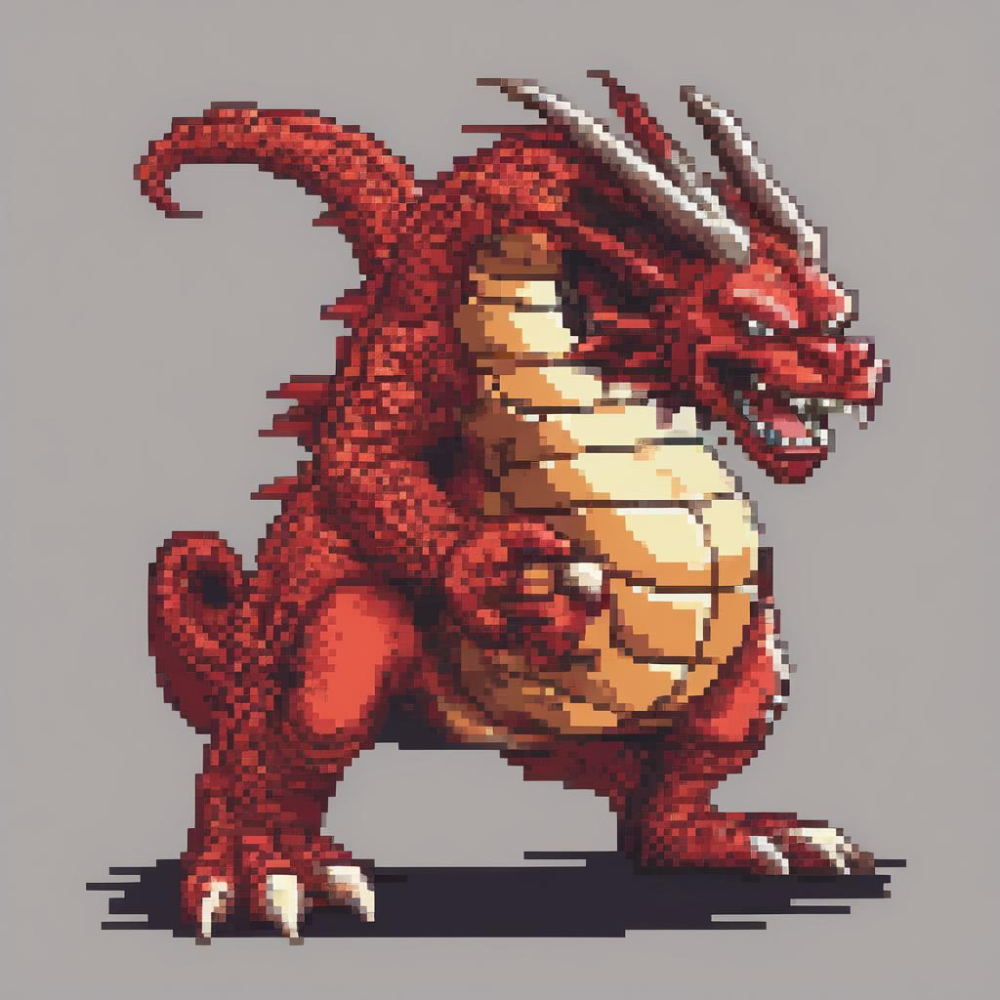

# Pixel Art Generator

Small project which uses FastAPI, Diffusers, and Docker to setup a container/server that let's you generate pixel art images based on a prompt.

### Repo File Tree

>|-docker-compose.yml
>|-sd-service
>|----------|-app.py
>|----------|-pipeline.py
>|----------|-Dockerfile
>|----------|-run.py
>|----------|-generator.py
>|----------|-download_model.py
>|----------|-requirements.txt
>|-main.py
>|-generated_images
>|----------|-test_2996.jpg
>|----------|-test_4314.jpg
>|----------|-test_2153.jpg
>|----------|-test_1333.jpg
>|----------|-test_6615.jpg
>|----------|-test_8800.jpg
>|----------|-test_6865.jpg
>|----------|-test_2042.jpg
>|----------|-test_5209.jpg
>|----------|-test_4785.jpg
>|----------|-test_7951.jpg
>|----------|-test_1622.jpg
>|----------|-test_1743.jpg
>|----------|-test_3497.jpg
>|-README.md

#### Inside sd-service
> **app.py** contains the logic for the FastAPI app and router and other details.

> **pipeline.py** contains code for downloading the model and LoRA:
> 1. Using "stabilityai/stable-diffusion-xl-base-1.0" for the model.
> 2. Using "nerijs/pixel-art-xl" LoRA Weights.
> 3. Weight's Name "pixel-art-xl.safetensors"

> **Dockerfile** instructions to build the docker image.

> **run.py** prints the prompt and executes the logic.

> **generator.py** loads the model and generates the image, then saves with a random number name.

> **download_model.py** extra file to download model if needed (recommended of donwloading once and then just loading from memory if possible, since download process can take anywhere from 10 to 30 minutes depending on various factors).

> **requirements.txt** frozen from after creating a local environment, with all necessary dependencies.

#### Standalone execution for development

> **main.py** contains standalone logic to execute the process in a single Python file without the necessity of containerazing.

#### README
> **README.md** the file you are reading.

### File Tree when docker container is Running
>|-app.py
>|-pipeline.py
>|-Dockerfile
>|-run.py
>|-generator.py
>|-download_model.py
>|-requirements.txt

**Note on docker-compose.yml**
> In order to run in a local machine must provide the capabiliy to the docker container to access the GPU otherwise it takes too long just with CPU.

## Some examples in the **"generated_images folder"**
Green Dragon Knight | Goblins
:-------------------|-------------------:
|
Guts                | Gandalf
|
Druid               |
|
Ballerina           | Samurai
|
Red Dragon 1           | Red Dragon 2
|